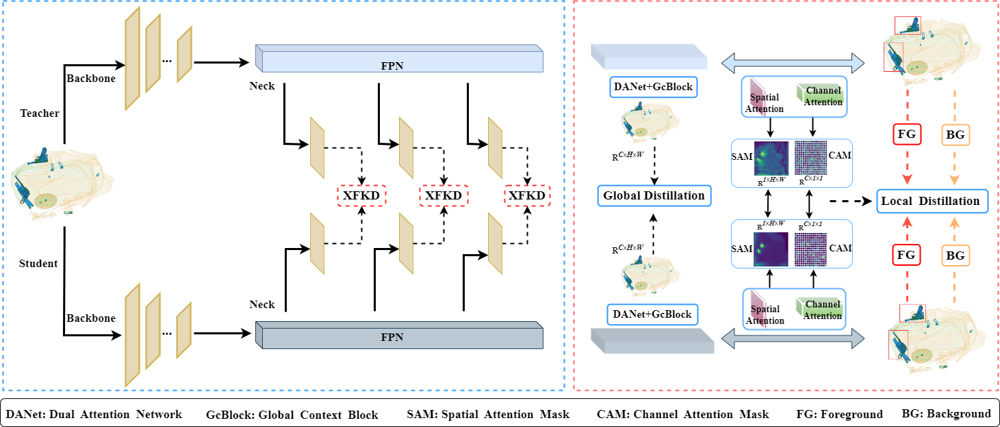

#  Feature Knowledge Distillation-based Model Lightweight for Prohibited Item Detection in X-ray Security Inspection Images
The code for the paper " Feature Knowledge Distillation-based Model Lightweight for Prohibited Item Detection in X-ray Security Inspection Images".<br>

## Requirements
python 3.9 <br>
pytorch 1.11.10 <br>
cuda 11.2 
## Dataset Preparation
1.This article uses the .xml format for training, and the SIXray <https://github.com/MeioJane/SIXray>, OPIXray<https://github.com/OPIXray-author/OPIXray> and COCO dataset<https://cocodataset.org/#home> needs to be downloaded before training.<br>

## Train
1.The Pretrained weights required for training can be downloaded from Google Cloud Drive.<br>

2.The default parameters of train.py are used to train the VOC dataset, and the training can be started directly by running train.py.<br>
  Before training classes_path, make it correspond to its own dataset path as the target class.<br>

3.Modify parameters of train.py

4.train.py. After modifying the classes_path, you can run train.py to start training. After training multiple epochs, the weights will be generated in the logs folder.
  ```python
  #single GPU
  python train.py

  #multi GPU
  CUDA_VISIBLE_DEVICES=0,1,...,N python train.py
  ```
## Evaluate (mAP)
1.Modify model_path and classes_path in yolo.py:<br>

2.model_path points to the trained weights file in the logs folder(Select a trained weight you want under the logs file and put it in model_data/ ).<br>

3.Run mAP.py. The evaluation results are saved in the map_out folder.
  ```python
  python get_map.py
  ```

## Acknowledgement

Our work was improved on the basis of FGD and also received help from the author. If you are interested, please pay attention to the paper "Focal and Global Knowledge Distillation for Detectors" <https://openaccess.thecvf.com/content/CVPR2022/papers/Yang_Focal_and_Global_Knowledge_Distillation_for_Detectors_CVPR_2022_paper.pdf>:<br>
